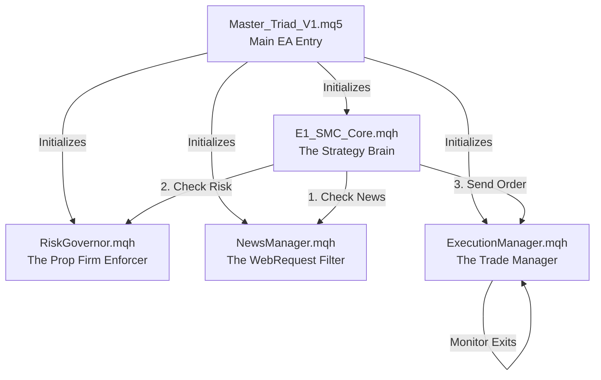

# Master_Triad_V1 Architecture Review

This document serves as the master blueprint and code review for the `Master_Triad_V1` Expert Advisor, designed specifically to pass and trade live Prop Firm challenges (e.g., The5ers, FTMO).

## 🏗️ 1. High-Level Architecture
The EA is strictly object-oriented, splitting responsibilities across 4 specialized engine classes. This prevents code bloat, ensures memory safety, and isolates Prop Firm risk management from raw trading logic.

---

## 🛡️ 2. Module Breakdown

### A. `Master_Triad_V1.mq5` (The Entry Point)
This is the outer shell of the EA. It contains the user inputs and the initialization (`OnInit`) sequence.
*   **V4 Lifecycle Gates:** It enforces the `InpStatisticalGatePassed` and `InpLifecycleLock` inputs. If the user hasn't explicitly set the gates to `true` or if the EA is in a "Payout Request" lock phase, it hard-halts the EA to prevent accidental live trading.
*   **Global Variables Setup:** It converts user inputs (like `InpUseDxySmtGate`) into MT5 Global Variables so the underlying core modules can access them dynamically.

### B. `RiskGovernor.mqh` (The Prop Firm Shield)
This module acts as a strict compliance officer. It tracks equity independently of the MT5 terminal to enforce The5ers rules.
*   **Trailing Maximum Drawdown:** It uses MT5's `GlobalVariableSet` to persist the `m_peakEquity` to your hard drive. If your VPS reboots, the EA remembers your true peak equity. If current equity falls 4.0% below the peak, it cuts all trades.
*   **Daily Breaker (Reset at 00:00):** It tracks the daily starting balance and ensures you never lose more than 2.2% in a single day.
*   **Friday Auto-Close:** Prevents any new trades from opening after Friday 16:00 to dodge weekend gaps.

### C. `NewsManager.mqh` (The Macro Filter)
Ported directly from your highly advanced V4 framework, this module handles fundamental news filtering.
*   **Live WebRequest:** On startup, it connects directly to `https://nfs.faireconomy.media` and downloads the ForexFactory XML calendar.
*   **CSV Caching:** It parses the XML for "High Impact" events and caches them to `triad_red_news.csv`. (If running in Strategy Tester, it bypasses the internet and reads the CSV directly).
*   **Blackout Zones (updated 2026-10-04):** if no usable calendar loaded at all, the gate **fails closed** (no new entries) instead of trading blind; a loaded week with no high-impact events is not a blackout; impact is matched case-insensitively.  The calendar maintains itself: the 1-second timer re-loads every 6 h live (or re-reads the CSV hourly), a failed refresh backs off 15 min, and a live calendar that cannot be refreshed for 48 h fails closed too.  The live source is the terminal's own calendar when the broker provides one - it covers 30 days ahead, unlike the FF file's seven ("this week") - with the FF download as the fallback; the Strategy Tester uses the CSV.  The event field is `server_time`: server time is the frame the gate compares against `TimeCurrent()`.
*   **Blackout Zones:** When `E1_SMC_Core` wants to take a trade, the NewsManager blocks it if we are within 30 minutes before or 15 minutes after a Red News event for the traded currency (or USD).

### D. `E1_SMC_Core.mqh` (The Smart Money Brain)
This is the algorithmic heart of the EA. It uses a 60-candle lookback window to find precise institutional patterns.
*   **Trend Bias:** Checks if the H4 Fast EMA is aligned with the H4 Slow EMA. Additionally, it enforces the V4 H1 Trend Bias, ensuring the most recent H1 candle is trading *above* a rising H1 50-EMA for longs.
*   **Daily ATR Exhaustion:** If the pair has already moved >80% of its Daily Average True Range (ATR), the EA refuses to take breakout trades.
*   **SMT Divergence Gate:** If trading EURUSD/GBPUSD, the EA checks the DXY RSI. If EURUSD is sweeping a low, but DXY is not exhausted at the high, the divergence fails, and the trade is blocked.
*   **Liquidity Sweep (implemented 2026-10-04):** the entry precondition looks for a takeout of prior liquidity that is then reclaimed - the sweep must print below the previous window's low (bullish) / above its high (bearish) and close back inside; the sweep bar is chosen with the same window and indexing as the CHoCH detector, so both agree.  (It was a stub returning `true` before.)
*   **Unmitigated Order Block Logic:** Finds the exact Change of Character (CHoCH) candle. Crucially, it scans *forward* from the CHoCH to the present to ensure price hasn't already wicked back and mitigated the block. If it's fresh, it calculates the Order Block edges.

### E. `ExecutionManager.mqh` (The Sniper)
Once `E1_SMC_Core` verifies a setup, this module takes over to handle the physical broker orders.
*   **Dual-Bracket Limits:** Places two limit orders—one on the Front Edge of the Order Block, one on the 50% Equilibrium line. 
*   **Spread & Minimum SL Protection:** Aborts execution if the broker spread spikes above 3.0 pips. If the Order Block is smaller than 5 pips, it artificially widens the Stop Loss to 5 pips to prevent spread-outs, and recalculates the Take Profit to perfectly maintain a 3.0R return.
*   **Stale Order Expiry:** If price doesn't return to trigger the limit order within 45 minutes (3 M15 bars), the setup is declared stale, and the limit order is deleted.
*   **Time Stop (Dead Money):** If a trade triggers but hovers around entry for 45 minutes without reaching +0.5R, it cuts the trade at market price.
*   **Staged Exits:** When a trade reaches +1.5R, it automatically closes 25% of the position to secure funding, and moves the Stop Loss to Break-Even + 0.2R. 

---

## 🔒 3. System Integrity & Failsafes
*   **Machine-Gun Prevention:** `E1_SMC_Core` uses cryptographic sweep-time tracking (`m_lastTradedSweepTime`). Once an Order Block is traded, it is marked permanently in MT5 Global Variables. Even if you get stopped out, the EA will never re-enter that exact same Order Block loop.
*   **State keys (2026-10-04):** every persisted value is namespaced `MasterTriad_<account>_<magic>_<field>`; the pre-upgrade values are adopted once on the first run and the old keys are deleted.  The daily-loss breaker freezes the remainder of the server day; the trailing-DD breaker freezes a full 48 h that the day boundary does not lift.
*   **Memory Persistence:** By utilizing `GlobalVariableSet` for Peak Equity, Breaker Reset Times, and Traded Sweeps, the EA is fully immune to MT5 crashes, VPS restarts, or accidental chart timeframe changes.
